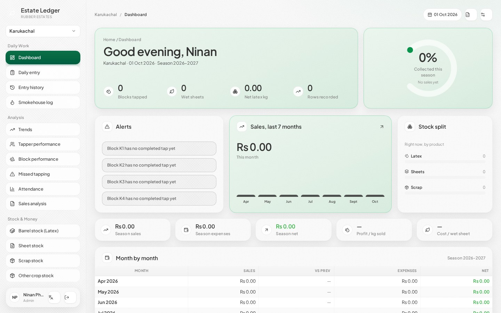
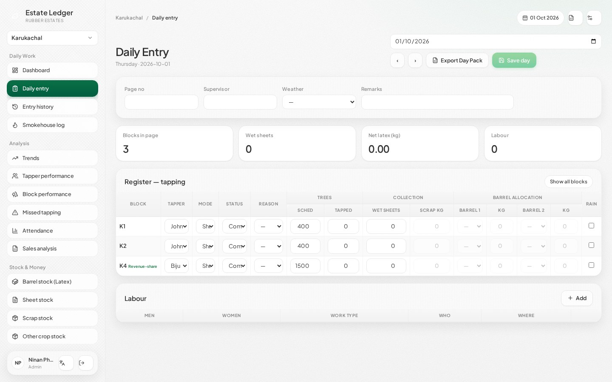
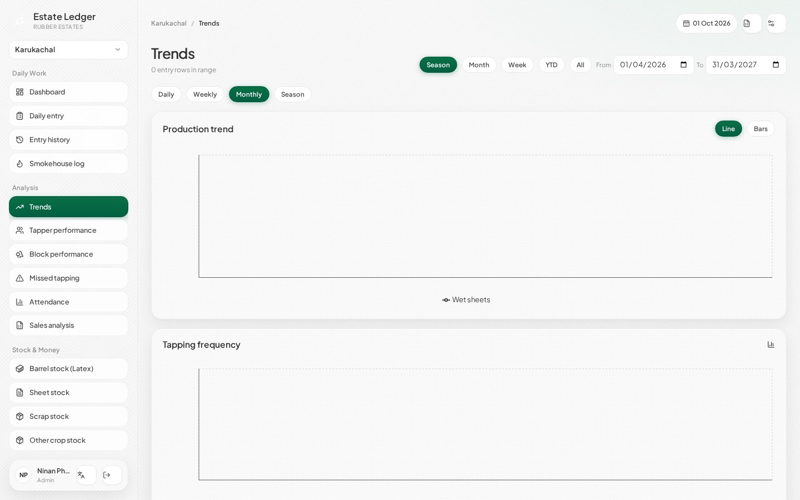
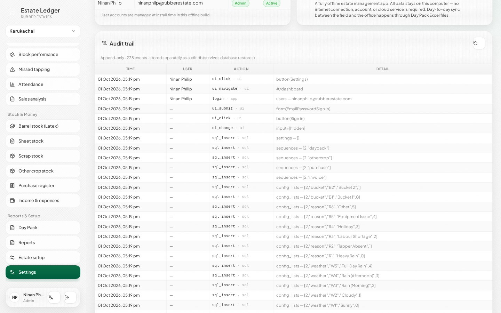
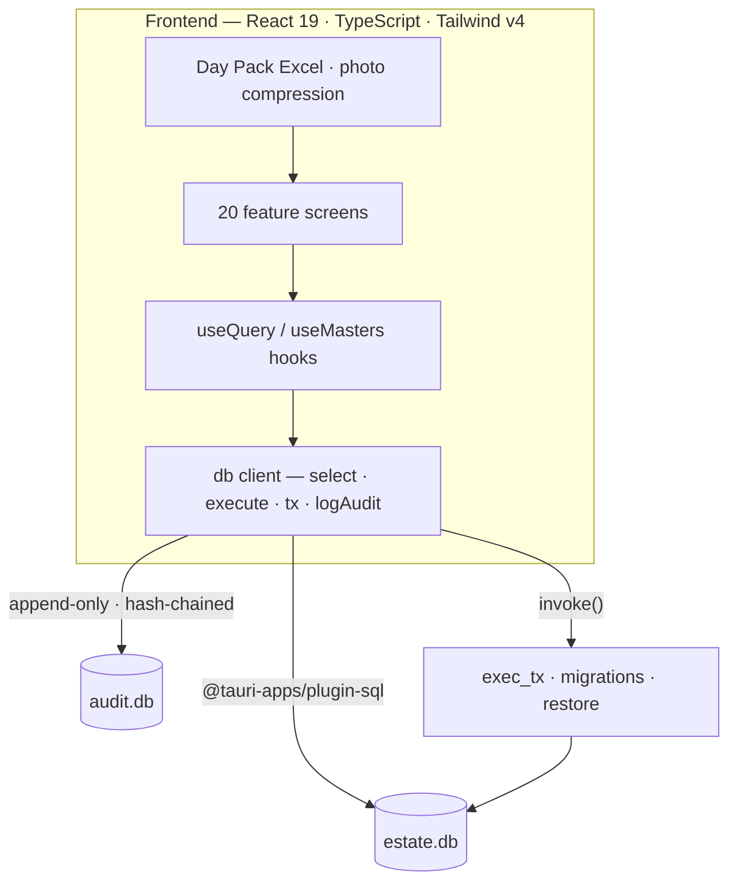

<h1 align="center">Estate Ledger</h1>

<p align="center">
  <b>The offline desktop ledger for rubber estates.</b><br>
  The paper register book your field staff already fill in — as an app that
  never needs the internet. Daily tapping → stock → sales → analysis, all on
  your own machine.
</p>

<p align="center">
  <a href="https://github.com/issacops/estate-ledger/releases/latest"></a>
  <a href="https://github.com/issacops/estate-ledger/actions/workflows/release.yml"></a>
  
  
  
  
  
</p>

<p align="center">
  
</p>

---

## What it is for

**Estate Ledger** is a desktop application for running the office side of a
rubber estate — built for two real, working estates (*Karukachal* and
*Kulashekaram*) whose staff already keep a paper register. It replaces the
transcription chore without changing the workflow: the **Daily Entry** screen is
laid out exactly like the register book, so office staff type what they see.

The app is **fully offline by design**. There is no server, no login-to-the-cloud,
no subscription and no telemetry. Everything lives in a single SQLite file on the
laptop; the day's data travels between field and office as an Excel **Day Pack**
over WhatsApp, with a review screen before anything is committed.

**Who it is for**

| If you are… | Start here |
|---|---|
| Estate owner / office staff using the app | [User guide](docs/05-USER-GUIDE.md) |
| Curious how the two estate workflows differ | [Workflows](docs/04-WORKFLOWS.md) |
| A developer building on it | [Development guide](docs/06-DEVELOPMENT.md) |
| Reviewing the design | [Architecture](docs/01-ARCHITECTURE.md) · [Data model](docs/02-DATA-MODEL.md) |
| Checking the business maths (DRC, rotation, barrels…) | [Domain logic](docs/03-DOMAIN-LOGIC.md) |

---

## Screenshots

<table>
  <tr>
    <td width="50%"></td>
    <td width="50%"></td>
  </tr>
  <tr>
    <td width="50%"></td>
    <td width="50%"></td>
  </tr>
</table>

---

## Features

**Daily work**
- **Daily Entry** — register-book grid matching the paper form; Sheet/Latex mode
  switch or bucket weighing, live totals, barrel validation, labour rows,
  save & export.
- **Entry history** with clash detection, **smokehouse log** (per-person batches),
  **attendance** and **missed-tapping** lists.

**Stock & money**
- **Barrel / latex hub** — FIFO dispatch, DRC-pending sales, reconciliation pill,
  invoices, buyer ledgers.
- **Sheet, scrap and other-crop hubs**, **purchase register** with vendor
  ledgers, **weekly cash book** with photos and print.
- **Day Pack sync** — export the saved day to styled Excel → WhatsApp → the owner
  imports with a New / Update / Conflict review screen before committing.

**Analysis**
- Dashboard with live gap alerts, **trends** (Daily / Weekly / Monthly / Season
  Apr–Mar), tapper & block performance, sales analysis, rain-cover ROI.
- **Reports** — 9-sheet master export and profit & loss.

**Admin & platform**
- Masters (blocks, tappers, barrels, coded lists, profile flags), roles
  (Admin / Staff), backup & restore, English + മലയാളം UI.
- **Append-only audit trail** — every click, save and data change is recorded in
  a *separate* `audit.db` with a SHA-256 hash chain; it survives database
  restores and cannot be rewritten (see [Data & privacy](#data--privacy--audit-trail)).

---

## Install

### Option A — download the app (estates & offices)

1. Open the **[latest release](https://github.com/issacops/estate-ledger/releases/latest)**
   and grab the installer for your machine:
   - **Windows 10/11** → `Estate-Ledger_…_x64-setup.exe` or `.msi`
   - **Linux** → `.deb` / `.AppImage`
   - **macOS** → `.dmg` (Apple Silicon & Intel)
2. Install and launch it. The **first run seeds** both estates, master data and
   two users — no setup server required.
3. Log in:

   | Email | Password | Role |
   |---|---|---|
   | `ninanphilp@rubberestate.com` | `ninan123@4` | Admin — everything |
   | `dailyentry@rubberestate.com` | `ninan123@4` | Staff — Daily Entry + Day Pack export |

   Passwords are hashed locally with PBKDF2 (never stored in clear text).

### Option B — build from source

Prerequisites: **Node.js 20+**, **Rust** (stable) and platform build tools
(Windows: MSVC Build Tools + WebView2; Linux: `webkit2gtk-4.1`,
`libayatana-appindicator` — see the
[Tauri prerequisites](https://v2.tauri.app/start/prerequisites/)).

```bash
git clone https://github.com/issacops/estate-ledger.git
cd estate-ledger
npm install

npm run tauri dev        # desktop app with hot reload
npm run tauri build      # installers → src-tauri/target/release/bundle/
```

> Windows installers must be built **on Windows** (the NSIS/MSI bundlers are
> platform-native).

---

## How to use

A typical day in the estate office:

1. **Transcribe the register** — open **Daily Entry**, pick the estate (Karukachal
   / Kulashekaram) and type the day's rows exactly as written in the book:
   tapper, block, wet sheets / latex, labour. Live totals update as you type and
   barrel entries are validated on save.
2. **Save the day** — the date is locked against double entry; **Entry history**
   shows it afterwards and flags clashes.
3. **Send the Day Pack** — *Day Pack → export* produces a styled Excel file for
   WhatsApp. The owner imports it and reviews every row
   (**New / Update / Conflict**) before committing.
4. **Read the numbers** — the **Dashboard** shows alerts and season KPIs;
   **Trends**, **Tapper performance**, **Sales analysis** and **Reports** answer
   the rest. The season runs **April → March**.
5. **Back up weekly** — *Settings → Create backup* writes a compact `.db` copy;
   *Restore from backup* brings it back (the audit trail is kept separately and
   survives restores).

**Where the data lives**

| OS | Database |
|---|---|
| Windows | `%APPDATA%\com.estateledger.app\estate.db` |
| Linux | `~/.config/com.estateledger.app/estate.db` |
| macOS | `~/Library/Application Support/com.estateledger.app/estate.db` |

---

## Tech stack

| Layer | Choice |
|---|---|
| Desktop shell | **Tauri 2** (Rust) — atomic transactions, schema migrations, restore |
| UI | **React 19** + **TypeScript** + **Tailwind CSS v4**, TanStack Router/Table/Virtual |
| State & forms | Zustand, React Hook Form + Zod |
| Charts | Recharts |
| Storage | **SQLite** via `@tauri-apps/plugin-sql` — one file for all business data |
| Excel | ExcelJS (Day Pack round-trip) |
| Tests | Vitest — 65 tests over the pure domain kernel |



**Project layout**

```
src/
├─ domain/     pure business kernels + unit tests (no React, no SQL)
├─ db/         SQLite client, auth, seeding, query hooks, audit store
├─ io/         Day Pack Excel roundtrip, photo compression
├─ ui/         design-system components (Herbal Isolates theme)
├─ app/        shell, sidebar, routing, stores
├─ pages/      one file per screen
└─ i18n/       English + Malayalam strings
src-tauri/     Rust shell, schema migrations, atomic transactions, restore
docs/          the documentation linked below
```

---

## Data, privacy & audit trail

- **No internet, ever** — no cloud sync, analytics or phone-home. Offline-first
  is the product, not a mode.
- **One database file** for everything business-related; move it with a backup.
- **Separate `audit.db`** — every touch (clicks, edits, navigation) and every
  log (SQL writes, logins, restores) is appended to a second SQLite file with a
  SHA-256 **hash chain** and SQL triggers that **reject updates and deletes**.
  Backups and restores never touch it, so history outlives any restore.
  Admins can review it under **Settings → Audit trail**.
- **PBKDF2-SHA256** password hashing (100k iterations, per-user salt) — roles
  gate screens, but treat this as an office tool, not a hardened multi-tenant
  service.

---

## Testing & quality

```bash
npx vitest run        # 65 tests — domain kernel, DB layer, UI flows, audit trail
npx tsc --noEmit      # strict type-check
npm run build         # type-check + production build
```

The domain logic (rotation, DRC, valuation, periods) is deliberately pure and
SQL-free so the business maths can be tested headlessly. See
[docs/06-DEVELOPMENT.md](docs/06-DEVELOPMENT.md) for conventions.

---

## Documentation

| Doc | What's in it |
|---|---|
| [01 · Architecture](docs/01-ARCHITECTURE.md) | Layering, security posture, process model |
| [02 · Data model](docs/02-DATA-MODEL.md) | Tables, keys, the audit store |
| [03 · Domain logic](docs/03-DOMAIN-LOGIC.md) | DRC, rotation, periods — the business maths |
| [04 · Workflows](docs/04-WORKFLOWS.md) | How the two estates differ |
| [05 · User guide](docs/05-USER-GUIDE.md) | Screen-by-screen manual for office staff |
| [06 · Development](docs/06-DEVELOPMENT.md) | Setup, commands, conventions |

---

## Releases

Versions follow `v0.MAJOR.MINOR` and are cut from `master`; every tagged push
builds installers for Windows, Linux and macOS in CI. All releases:
**[github.com/issacops/estate-ledger/releases](https://github.com/issacops/estate-ledger/releases)**
